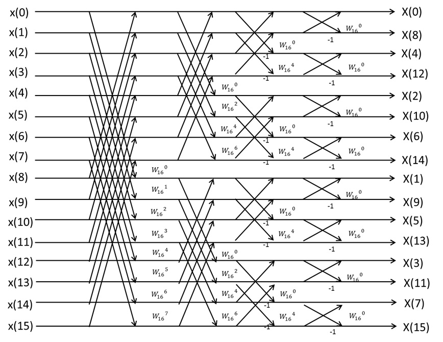
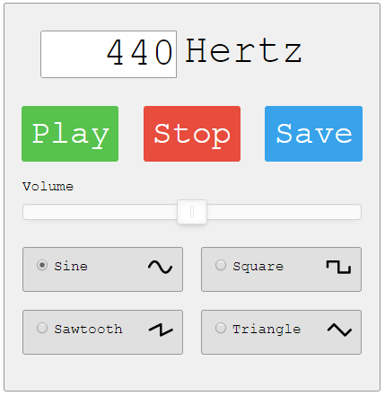
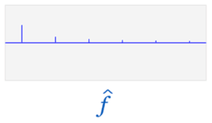
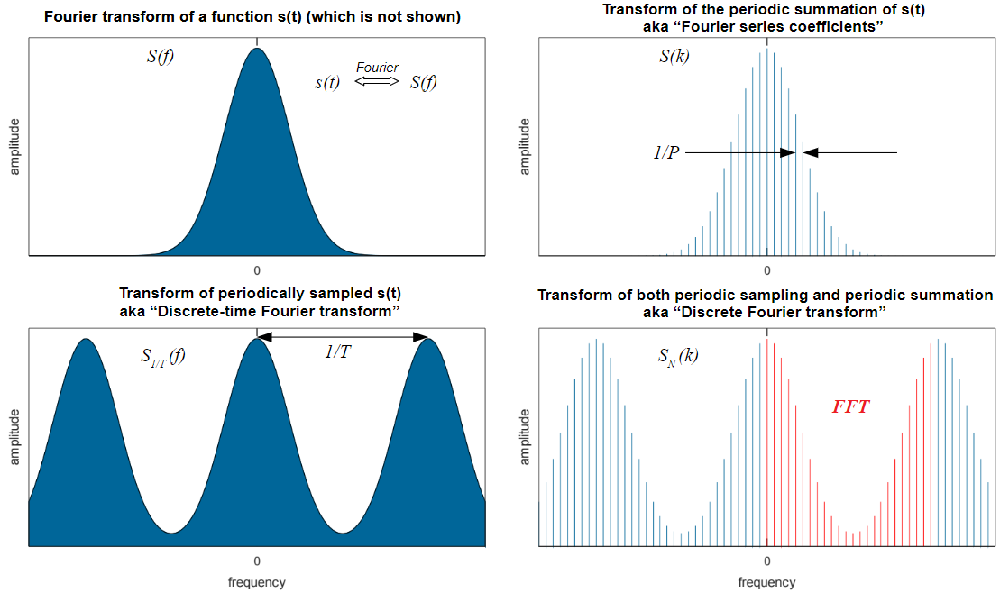

# Oscilliscope FFT

## Goals:

Use the **FFT** circuit in our Oscilloscopes:

Look at the frequencies or **DFT** that make up sound generated from [web pages](http://onlinetonegenerator.com/).

Make chart of the sound sine frequency chosen, screen shot of the DFT display and the data sampling rate of the oscilloscope. 

Predict the change oscilloscope setting that need to be changed and the DFT display upon changing the sound sine frequency. 

Change frequency to [square](https://en.wikipedia.org/wiki/Square_wave), [sawtooth](https://en.wikipedia.org/wiki/Sawtooth_wave) and [Triangle](https://en.wikipedia.org/wiki/Triangle_wave). Relate the DFT display to their series expansions. 

Capture data from the above and practice using python [sympy](https://docs.sympy.org/latest/modules/discrete.html#fast-fourier-transform) and [scipy](https://docs.scipy.org/doc/scipy/reference/generated/scipy.fftpack.fft.html#scipy.fftpack.fft) fft and ifft algorithms to recreate the output of the oscilloscope. 

## Background: 

Sound is going to be our input. Hopefully you have heard of the  [Fourier Transform](https://en.wikipedia.org/wiki/Fourier_series) (FT) in your study of [series expansions](https://en.wikipedia.org/wiki/Series_expansion). Here we see a square wave composed of a series of sinusoids added together.

.gif)

The last picture of  the above animation is the **DFT** of the square wave function.

The oscilloscope output is called a Discrete Fourier Transform display or  [DFT](https://en.wikipedia.org/wiki/Discrete_Fourier_transform). The **DFT** is the output which is seen when pressing the oscilloscope **fft** button. 

DC or a frequency of 0 is on the left. The right extreme is determined by the oscilloscope settings. 

Lab work uses the circuit. Classwork starts off creating the fft algorithm from scratch in python, then explores how it works in more detail using already written C versions of **fft()** and **ifft()** through [sympy](https://docs.sympy.org/latest/modules/discrete.html#fast-fourier-transform) and [scipy](https://docs.scipy.org/doc/scipy/reference/generated/scipy.fftpack.fft.html#scipy.fftpack.fft). **ifft()** is the inverse fft algorithm .. something an oscilloscope can't do.  

We will spend 3 lectures on the [DTFT](https://en.wikipedia.org/wiki/Discrete-time_Fourier_transform). The rest of the class is about the DFT. 

1/T is the period of a pattern in the input signal. 

1/P is the data sampling rate of the oscilloscope or network analyzer.

The words "amplitude" indicate that there is  missing plot describing the phase of a complex number in each of the above diagrams. 

## Applications

 [FFT is one of the top 10 most influential algorithms](https://www.computer.org/csdl/mags/cs/2000/01/c1022.html) (IEEE article) with applications in:

detecting cracks in structures
AI recognizing any biometric
cell phone apps like spotify that recognize songs and copyright infringement
Radar friend or foe recognition
Hearing aid noise elimination
wireless location
bird call evolution
edge detection for pick and place robots
Lie detection
How our [brains](https://en.wikipedia.org/wiki/Neural_oscillation) work
 [wagon wheel affect](https://en.wikipedia.org/wiki/Wagon-wheel_effect) 

## FFT Versions

The FFT algorithm is customized, optimized, made faster for various reasons from detecting exoplanets, to figuring out where the natural gas mounds on the ocean floor are. The goal here is to link up all of them .. and then determine if they have been implemented in hardware or not.

[wikipedia versions](https://en.wikipedia.org/wiki/Category:FFT_algorithms) 

|      | description   |
| ---- | ---- |
|ADFT| Adaptive Discrete Fourier Transform|
|BCGFFT|Bi- Conjugate Gradient Fast Fourier Transform|
|CG-FFT| 		Conjugate Gradient Fast Fourier Transform|
|CP-FTMW| Chirped Pulse Fourier Transform Microwave |
|DFT |		Discrete Fourier Transform|
|DFTI 	|	Discrete Fourier Transform Interface|
|DFTS |		Dispersive Fourier Transform Spectrometry|
|DIFT 	|	Discrete Inverse Fourier Transform|
|DTFS |		Discrete Time Fourier Series|
|DTFT 	|	Discrete Time Fourier Transform|
|FFT |		Fast Fourier Transform|
|FT 	|	Fourier Transform|
|FT-FAM| 	Fourier Transform - Faradic Admittance Measurement|
|FT-NMR |	Fourier Transform Nuclear Magnetic Resonance|
|FTICR |		Fourier Transform Ion Cyclotron Resonance|
|FTIR 	|	Fourier Transform Infrared|
|FTMS	|	Fourier Transform Mass Spectrometry|
|FTMWS 	| Fourier Transform Microwave Spectroscopy |
|FTPL 	|	Fourier Transform Photo Luminescence|
|FTSI	|	Fourier Transform Spectral Interferometry|
|IFFT 	|	Inverse Fast Fourier Transform|
|IFT 	|	Inverse Fourier Transform|
|NB-FTMW| Narrow-Band Fourier Transform Microwave |
|NRFT| 		Non- Real Fourier|
|WBFT| 		Wavelet-Based Fourier Transform|
|WDFT|		Warped Discrete Fourier Transform|
|WFTA|		Winograd Fourier Transform Algorithm|
|WFTM| 		Windowed Fourier Transform Method|

# Lab Equipment 

## Oscilloscopes in General 

What is N? 

**N** is the number of data points collected per pattern.
**N** is the number of frequencies in a series that are used to try and fit the pattern(s).
The larger **N** is, the better. N is the number of red data points in the above graphic.

## Our Oscilliscope(s)

What is **N** of our oscilloscope?

What does the [oscilloscope manual](https://drive.google.com/drive/folders/1Md_ONaf2zu1kSvIkJbwgec4CIia3UAFx) say about it's fft?

## Audio Cable

Get the sound working on a computer.

Connect the audio cable to the oscilloscope. It has a miniature, stereo [phone jack](https://en.wikipedia.org/wiki/Phone_connector_(audio)) on one end and three wires at the other. One wire will be ground .. no insulation. The other two wires will be associated with stereo sound. Use one of the stereo sound wires and the ground wire to connect to the oscilloscope. 

## USB Storage Device

The oscilloscope data and perhaps screen shots can be dumped onto a thumb drive and analyzed with software. 

# Steps

